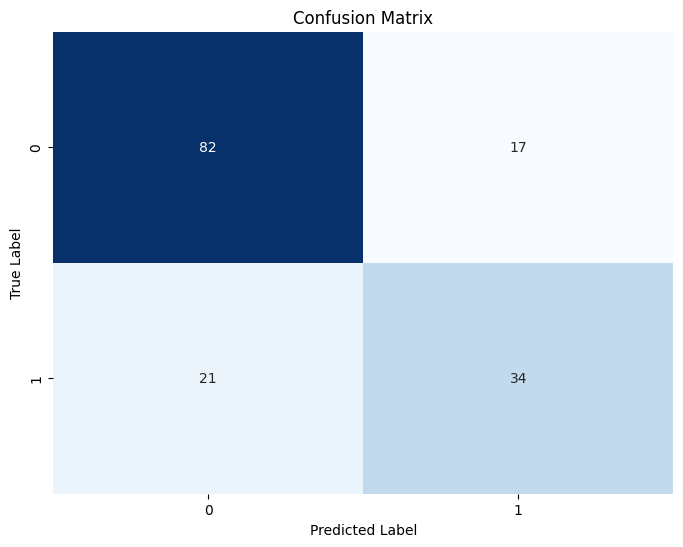
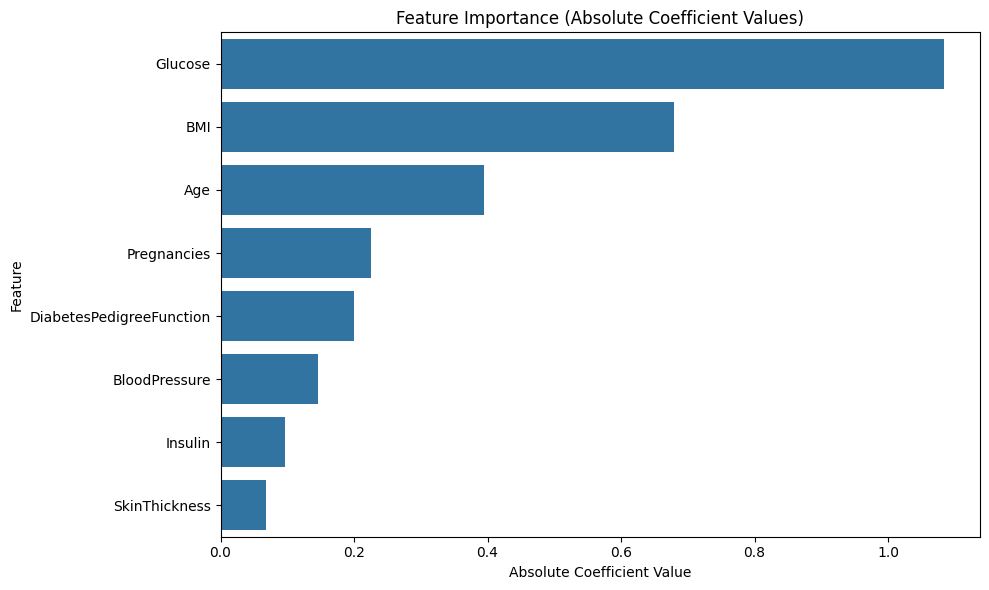

# Diabetes Prediction Agent Analysis


Authors:
- Noah Danan
- Kenny Nguyen
- Yuliana Chavez

[Link to Jupyter Notebook](https://github.com/ken004ucsd/CSE150A-Group-Project/blob/milestone3/Milestone3.ipynb)

## PEAS/Agent Analysis (5pts)

### PEAS Framework
- **Performance Measure**: Accuracy of diabetes prediction, precision, recall, and F1-score for both positive and negative diabetes diagnoses
- **Environment**: Clinical setting with patient data including physiological measurements and medical history
- **Actuators**: Risk prediction output (positive/negative) and probability score for diabetes
- **Sensors**: Patient data input including Pregnancies, Glucose, Blood Pressure, Skin Thickness, Insulin, BMI, Diabetes Pedigree Function, and Age

### Background
This agent is designed to predict whether a patient has diabetes based on several clinical measurements. It serves as a diagnostic support tool for healthcare providers to identify patients at risk of diabetes, allowing for earlier intervention and treatment. The agent uses the Pima Indians Diabetes Database, which consists of diagnostic measurements from female patients of Pima Indian heritage.

## Agent Setup, Data Preprocessing, Training setup (20pts)

### Dataset Exploration

The dataset contains 768 instances with 8 attributes plus the target variable:

1. **Pregnancies**: Number of times pregnant (0-17)
   - Mean: 3.85
   - Role: Demographic factor that can indicate risk level as repeated pregnancies can affect insulin sensitivity

2. **Glucose**: Plasma glucose concentration after 2 hours in an oral glucose tolerance test (mg/dL)
   - Mean: 120.89
   - Role: Critical diagnostic feature as elevated glucose levels are a direct indicator of diabetes

3. **BloodPressure**: Diastolic blood pressure (mm Hg)
   - Mean: 69.11
   - Role: Comorbidity indicator as hypertension often accompanies diabetes

4. **SkinThickness**: Triceps skin fold thickness (mm)
   - Mean: 20.54
   - Role: Indicator of body fat, which affects insulin resistance

5. **Insulin**: 2-Hour serum insulin (mu U/ml)
   - Mean: 79.80
   - Role: Direct measure of pancreatic function and insulin response

6. **BMI**: Body Mass Index (weight in kg/(height in m)²)
   - Mean: 31.99
   - Role: Major risk factor for Type 2 diabetes as higher BMI correlates with insulin resistance

7. **DiabetesPedigreeFunction**: Diabetes pedigree function (a function scoring likelihood of diabetes based on family history)
   - Mean: 0.47
   - Role: Genetic component consideration reflecting hereditary influence on diabetes risk

8. **Age**: Age in years
   - Mean: 33.24
   - Role: Demographic risk factor as diabetes risk increases with age

9. **Outcome**: Class variable (0 or 1) indicating whether the patient has diabetes
   - Distribution: 65.1% negative (0), 34.9% positive (1)
   - Role: Target variable to be predicted

The dataset initially appeared to have no missing values, but domain knowledge suggests that zeros in certain medical measurements (Glucose, BloodPressure, SkinThickness, Insulin, BMI) likely represent missing data rather than actual zero measurements.

### Variable Interactions and Model Structure

The correlation matrix reveals several important relationships:

1. **Glucose and Outcome** (0.47): The strongest predictor of diabetes, which aligns with medical knowledge that elevated blood glucose is a primary indicator of diabetes.

2. **BMI and Outcome** (0.29): The second strongest correlation, reflecting the known relationship between obesity and Type 2 diabetes.

3. **Age and Outcome** (0.24): Positive correlation confirming that diabetes risk increases with age.

4. **Pregnancies and Age** (0.54): Strong correlation showing that older women tend to have had more pregnancies.

5. **SkinThickness and Insulin** (0.44): Moderate correlation suggesting that higher body fat (measured by skin thickness) is associated with higher insulin levels, consistent with insulin resistance patterns.

For this predictive task, a Logistic Regression model was chosen for several reasons:

1. **Binary Classification**: Logistic regression is well-suited for binary outcome prediction (diabetes/no diabetes).

2. **Interpretability**: The model provides coefficient values that directly indicate the influence of each feature on the outcome, which is valuable in medical contexts where understanding the decision process is critical.

3. **Variable Relationships**: The dataset's features have roughly linear relationships with the log-odds of the outcome, particularly after scaling, making logistic regression appropriate.

4. **Efficiency**: The model performs well with limited data (768 instances) and is computationally efficient.

5. **No Overfitting**: The relative simplicity of logistic regression helps avoid overfitting, especially important with medical data where patterns may be complex but limited by sample size.

### Parameter Calculation Process

The logistic regression model uses maximum likelihood estimation to calculate its parameters (coefficients). The process works as follows:

1. **Feature Scaling**: Before parameter calculation, features were standardized using `StandardScaler` from scikit-learn, which subtracts the mean and divides by the standard deviation for each feature:
   ```
   X_standardized = (X - mean(X)) / std(X)
   ```

2. **Logistic Function**: The model uses the logistic function to transform a linear combination of features into a probability between 0 and 1:
   ```
   P(diabetes) = 1 / (1 + e^-(β₀ + β₁X₁ + β₂X₂ + ... + βₙXₙ))
   ```
   where β₀ is the intercept and β₁...βₙ are the coefficients for features X₁...Xₙ.

3. **Loss Function**: The model optimizes the log-likelihood function:
   ```
   L(β) = Σ[y_i * log(P(x_i)) + (1-y_i) * log(1-P(x_i))]
   ```
   where y_i is the actual outcome and P(x_i) is the predicted probability.

4. **Optimization**: The scikit-learn implementation uses the LBFGS optimizer (limited-memory Broyden-Fletcher-Goldfarb-Shanno algorithm) to maximize the log-likelihood function and find the optimal coefficient values.

### Libraries Used

The implementation uses several libraries from the scikit-learn ecosystem:

1. **sklearn.model_selection.train_test_split**: Used to split the dataset into training (80%) and testing (20%) sets with stratification to maintain the same class distribution in both sets.

2. **sklearn.preprocessing.StandardScaler**: Used for feature scaling to normalize the features to have zero mean and unit variance, which improves model performance and convergence.

3. **sklearn.linear_model.LogisticRegression**: Implements the logistic regression model with L2 regularization by default. The `max_iter` parameter was set to 1000 to ensure convergence.

4. **sklearn.metrics**: Provides functions for model evaluation (accuracy_score, classification_report, confusion_matrix).

Sources:
- Scikit-learn: https://scikit-learn.org/stable/
- Pandas: https://pandas.pydata.org/
- NumPy: https://numpy.org/
- Matplotlib: https://matplotlib.org/
- Seaborn: https://seaborn.pydata.org/

## Train your model! (10pts)

The model training process involved the following steps:

1. Data preprocessing:
   ```python
   # Replace zeros with NaN for medically impossible zero values
   columns_to_process = ['Glucose', 'BloodPressure', 'SkinThickness', 'Insulin', 'BMI']
   df_processed = df.copy()
   for column in columns_to_process:
       df_processed[column] = df_processed[column].replace(0, np.NaN)
   
   # Fill missing values with mean
   for column in columns_to_process:
       df_processed[column] = df_processed[column].fillna(df_processed[column].mean())
   ```

2. Feature and target separation:
   ```python
   X = df_processed.drop('Outcome', axis=1)
   y = df_processed['Outcome']
   ```

3. Train-test split:
   ```python
   X_train, X_test, y_train, y_test = train_test_split(X, y, test_size=0.2, random_state=42)
   ```

4. Feature scaling:
   ```python
   scaler = StandardScaler()
   X_train_scaled = scaler.fit_transform(X_train)
   X_test_scaled = scaler.transform(X_test)
   ```

5. Model training:
   ```python
   model = LogisticRegression(max_iter=1000)
   model.fit(X_train_scaled, y_train)
   ```

6. Prediction function:
   ```python
   def predict_diabetes(patient_data):
       # Scale the patient data
       patient_data_scaled = scaler.transform([patient_data])
       # Make prediction
       prediction = model.predict(patient_data_scaled)[0]
       # Get probability
       probability = model.predict_proba(patient_data_scaled)[0][1]
       
       return "Positive" if prediction == 1 else "Negative", probability
   ```

## Conclusion/Results (20pts)

### Numerical Results

The logistic regression model achieved the following performance metrics:

- **Accuracy**: 75.32%
- **Precision**:
  - Class 0 (No Diabetes): 0.80
  - Class 1 (Diabetes): 0.67
- **Recall**:
  - Class 0: 0.83
  - Class 1: 0.62
- **F1-score**:
  - Class 0: 0.81
  - Class 1: 0.64

### Interpretation of Results



The confusion matrix shows:
- True Negatives: 82
- False Positives: 17
- False Negatives: 21
- True Positives: 34

These results indicate that:

1. **Higher performance for negative cases**: The model is better at correctly identifying patients without diabetes (83% recall) than identifying those with diabetes (62% recall).

2. **Imbalanced dataset impact**: The class imbalance (65% negative, 35% positive) likely contributes to the model's better performance on negative cases.

3. **False negatives concern**: The 21 false negatives (patients with diabetes incorrectly classified as not having diabetes) are particularly concerning from a medical perspective, as these represent missed diagnoses.

4. **Baseline comparison**: Random guessing would achieve approximately 65% accuracy for always predicting the majority class (no diabetes). Our model's 75% accuracy represents a 10 percentage point improvement over this baseline.



The feature importance analysis reveals that Glucose is by far the most influential predictor, followed by BMI and Age. This aligns with medical knowledge that elevated blood glucose levels are the primary indicator of diabetes, while BMI and age are known risk factors.

The model's predictions on sample patients also demonstrate reasonable behavior:
- Patients with high glucose levels are generally predicted as positive
- Patients with normal glucose and other measurements are predicted as negative
- The probability scores provide additional nuance to the binary predictions

### Points of Improvement

1. **Address class imbalance**: The current dataset has approximately 65% negative and 35% positive cases. Techniques such as SMOTE (Synthetic Minority Over-sampling Technique) or class weighting could be applied to improve performance on the minority class.

2. **Feature engineering**:
   - Create interaction terms between features, particularly between BMI and Age, as their combined effect may be greater than their individual effects
   - Add polynomial features for Glucose, as its relationship with diabetes risk may be non-linear
   - Create age groups or BMI categories to capture threshold effects

3. **Missing data handling**: While we replaced zeros with means, more sophisticated imputation methods could be used:
   - K-nearest neighbors imputation
   - Multiple imputation by chained equations (MICE)
   - Regression imputation using other features

4. **Outlier treatment**: The boxplots reveal potential outliers in several features (particularly Insulin and SkinThickness). Applying robust scaling or winsorization could reduce their impact.

5. **Alternative models**: Consider non-linear models that might capture more complex relationships:
   - Random Forest or Gradient Boosting classifiers could capture non-linear patterns and feature interactions
   - Neural networks might learn more complex patterns from the data
   - Support Vector Machines with non-linear kernels could find more complex decision boundaries

6. **Hyperparameter tuning**: Optimize the logistic regression's regularization strength (C parameter) and penalty type (L1 vs L2) using cross-validation.

7. **Clinical thresholds**: Currently, the model uses a 0.5 probability threshold for classification. Adjusting this threshold based on the clinical context could optimize for sensitivity (reducing false negatives) at the expense of specificity.

8. **Feature expansion**: Incorporate additional features if available:
   - HbA1c levels (glycated hemoglobin)
   - Fasting blood sugar measurements
   - Family history details beyond the pedigree function
   - Lifestyle factors (diet, exercise habits)

9. **Ensemble methods**: Combine multiple models (e.g., logistic regression, random forest, and neural networks) through voting or stacking to potentially improve performance.

10. **Explainability techniques**: Apply SHAP (SHapley Additive exPlanations) values or LIME (Local Interpretable Model-agnostic Explanations) to provide more nuanced explanations of individual predictions for clinical use.

## Additional Notes

All code implementation and analysis was performed using Python libraries including pandas, numpy, scikit-learn, matplotlib, and seaborn, as shown in the provided code.

We implemented generative AI to assist in formulating portions of the README.md documentation and aggregating results data for efficient analysis and interpretation. Additionally, we utilized these technologies to generate synthetic datasets for testing purposes.

Dataset source: Pima Indians Diabetes Database from Kaggle (https://www.kaggle.com/datasets/mathchi/diabetes-data-set/data)
